# Array-Archers_042
Project for Harley Davidson.

# Harley Davidson
Welcome to the Harley Davidson fan website! This platform is dedicated to celebrating the legacy and culture of Harley Davidson motorcycles. Whether you're a seasoned rider or a new enthusiast, our website is your go-to source for everything Harley Davidson. Explore the latest models, learn about the brand's rich history, find local events, and connect with a community of passionate riders. Ride on, and experience the freedom of the open road with Harley Davidson.


## Run Locally

Clone the project

```bash
  git clone https://github.com/RahulGeorge96/Array-Archers_042.git
```

Go to the project directory

```bash
  cd Array-Archers_042
```

Install dependencies

```bash
  npm install
```

Start the server

```bash
  npm run dev
```


## 🔗 Developers
- Vikram Kumar Choudhary: (https://github.com/vikram0104irctc)

- Rahul George : (https://github.com/RahulGeorge96)

- Everus Lainus: (https://github.com/EverusLainus)

- Shashi Varshneya: (https://github.com/whyshashi)


## Tech Stack

**Frontend:** HTML, CSS, JSX, REACT   
*libraries:* Redux, ChakraUI, axios, React-router-dom, react-icons, firebase, slick-carousel
**Backend:** Node.js, Mongodb, Express.js, Firebase, Google API


# Project Type
- Frontend | Backend

# Deployed Link
- https://harley-davidson-fan.vercel.app/

# Presentation Link
- https://youtu.be/wukZ4Z77_C4
  
# Features 
- Sign-up and sigin user.
- Add to cart functionality.
- Purchase Product on the webite.
- Pay online Functionality.

# Landing Page 

- Discover the latest Harley Davidson motorcycles and embrace the spirit of the open road.
- Dive into the rich history and connect with a vibrant community of passionate riders.

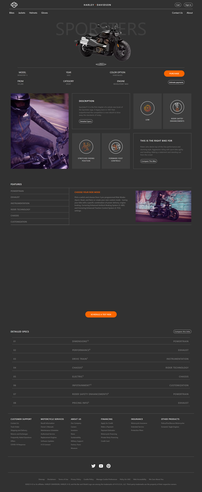

# SignUp Page
- To order any Product on our website user have to login and then can do any order .
- Signin was achieved with the help of Local storage and firebase .
- They can Signup and Login using google accounts.
- No user From same ID can signin , he/she have to enter different email ID.

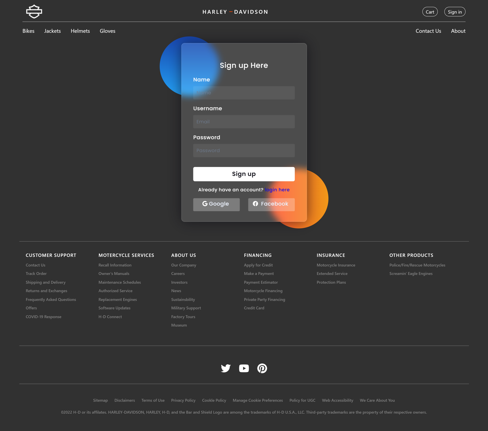

# Login Page
- After successful signin For Authentication he has to login as a valid user so can do any order and can visit website.
- Login is Achieved by Local Storage and after verfication he can proceed to visit website.
- They can Login using google accounts.

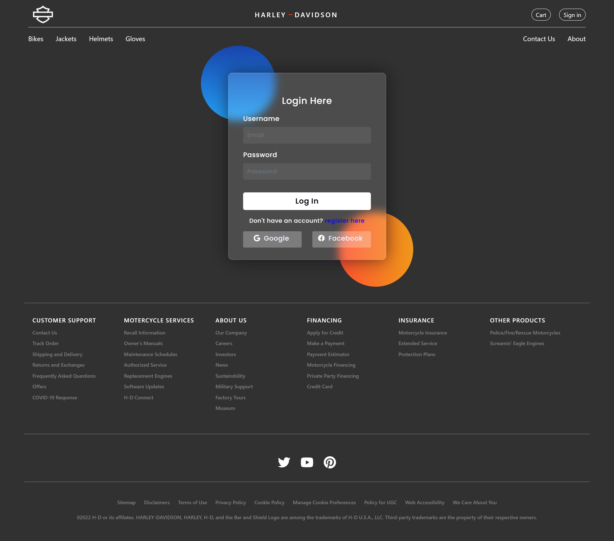

# Bikes
- User can do shopping for Bikes, also User have option to add to cart.
- All the product are shown with the help carausel in unique the eye catching Mannner.

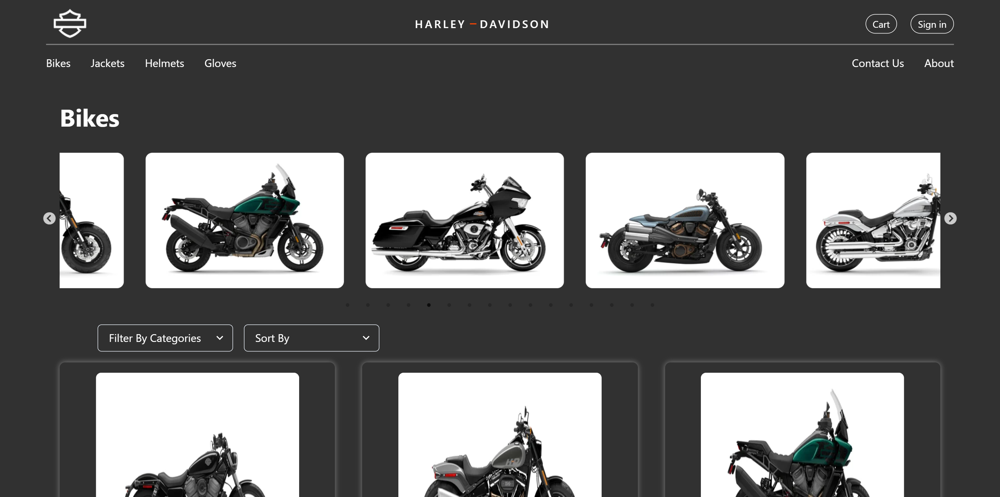

# Jackets
- User can do shopping for Jackets, also User have option to add to cart.
- All the product are shown with the help carausel in unique the eye catching Mannner.

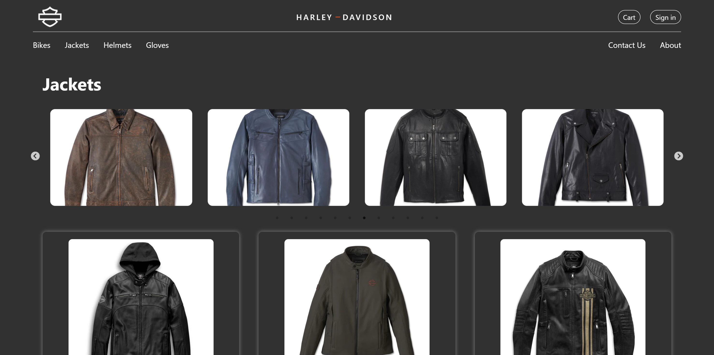


# Helmets
- User can do shopping for Helmets, also User have option to add to cart.
- All the product are shown with the help carausel in unique the eye catching Mannner .

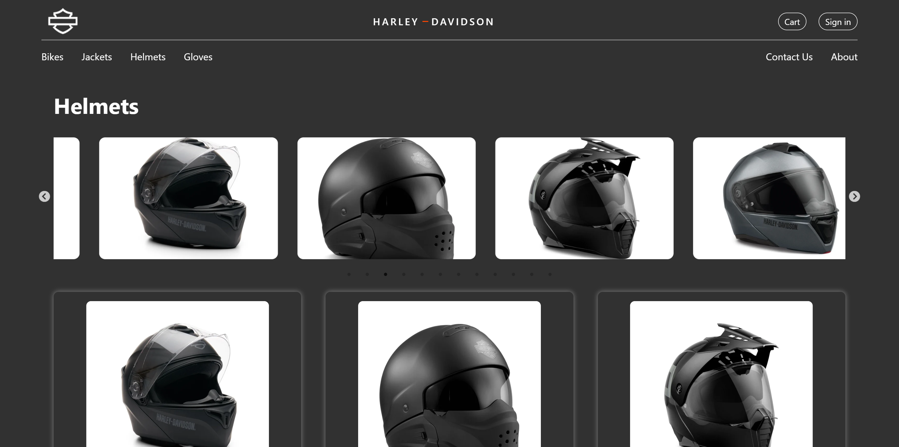

# Gloves
- User can do shopping for Gloves, also User have option to add to cart.
- All the product are shown with the help carausel in unique the eye catching Mannner .

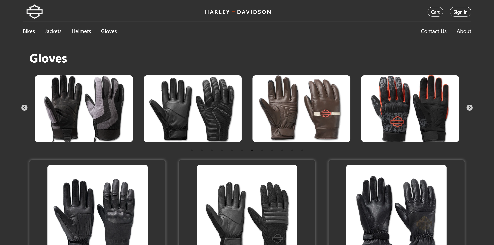


# Product Description
- Detailed Information: Comprehensive details about the product, including name, Description, and price.
- High-Quality Images: Multiple high-resolution images of the product from various angles, allowing users to view the product closely.

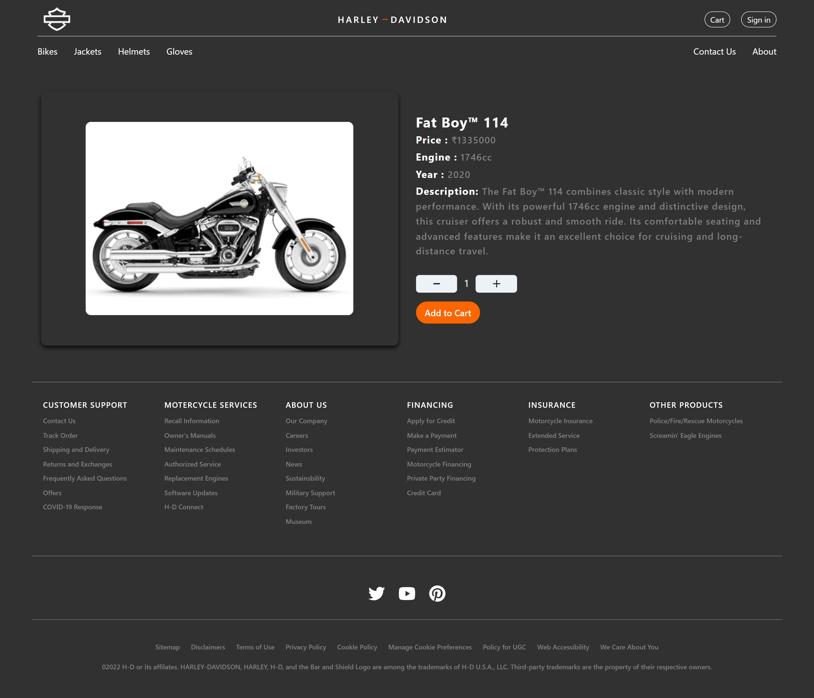

# Add to cart
- Cart Overview: Displays a summary of all items added to the cart, including product images, descriptions, prices, and quantities.
- Proceed to Checkout: A button to navigate to the checkout page and complete the purchase.

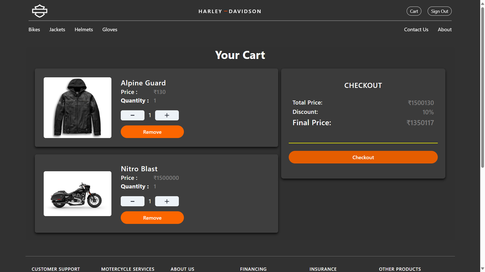

# Payment Checkout
- Payment Options: Secure payment gateways for processing transactions.
- Order Confirmation: Confirmation of the order with details for tracking and delivery.

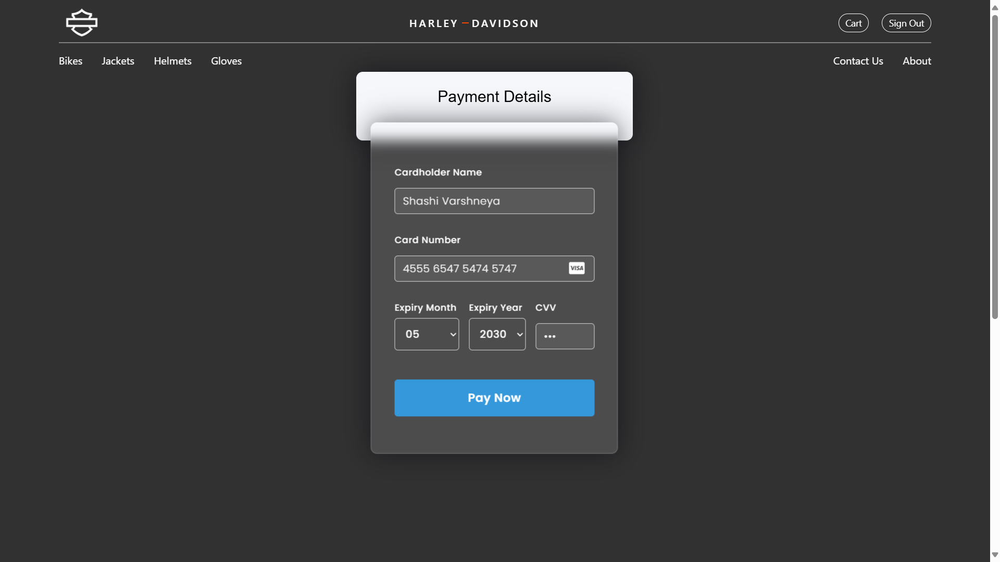
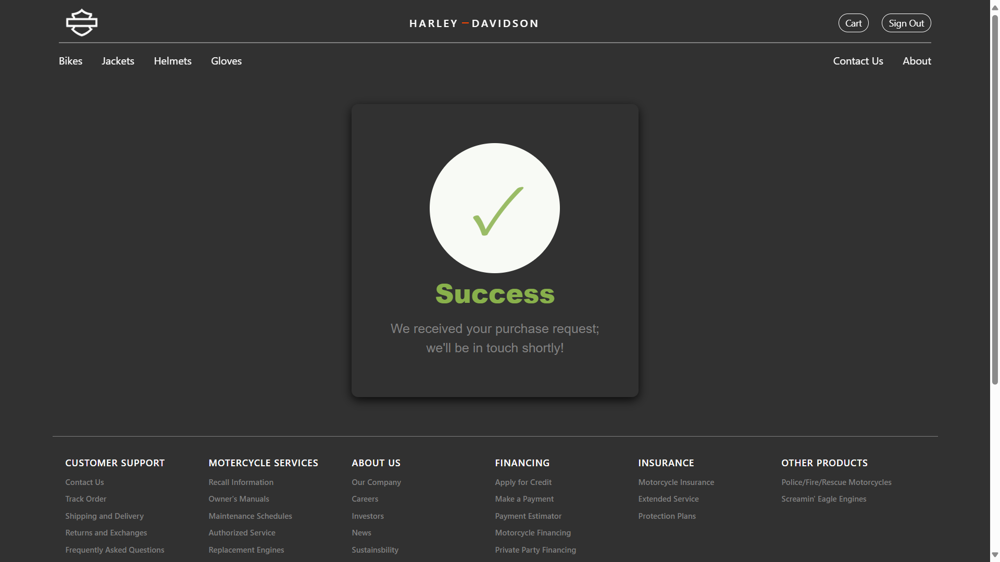

# FAQ

### Is the website optimized for mobile devices?

Yes, the website is fully responsive and optimized for a seamless experience across all devices, including desktops, tablets, and smartphones.

### What is the deployment process for the website?

The website is deployed using a CI/CD pipeline through GitHub Actions, with automatic deployment to a cloud provider (Netlify) whenever changes are pushed to the develop branch.


# Project Directory Structure
```plaintext
ARRAY-ARCHERS_042/
  ├── node_modules/
  ├── public/
  ├── src/
  │   ├── assets/
  │   ├── components/
  │   │   ├── landingPage/
  │   │   │   ├── detailedPage.css
  │   │   │   ├── detailedPage.jsx
  │   │   │   ├── detailedSpaces.css
  │   │   │   ├── detailedSpaces.jsx
  │   │   │   ├── featurePage.css
  │   │   │   ├── featurePage.jsx
  │   │   ├── footer/
  │   │   │   ├── footer.css
  │   │   │   ├── footer.jsx
  │   │   ├── HeroSection/
  │   │   │   ├── herosection.css
  │   │   │   ├── herosection.jsx
  │   │   ├── videoPage/
  │   │   │   ├── videoPage.css
  │   │   │   ├── videoPage.jsx
  │   │   ├── CheckoutCard.jsx
  │   │   ├── Config.jsx
  │   │   ├── ContactModal.jsx
  │   │   ├── GoogleSignin.jsx
  │   │   ├── landingPage.jsx
  │   │   ├── loginPage.jsx
  │   │   ├── navBar.css
  │   │   ├── navBar.jsx
  │   │   ├── ProductCard.jsx
  │   │   ├── signupPage.css
  │   │   ├── signupPage.jsx
  │   ├── contexts/
  │   │   ├── ModalContext.jsx
  │   ├── pages/
  │   │   ├── AboutPage.jsx
  │   │   ├── BikesPage.jsx
  │   │   ├── CartPage.jsx
  │   │   ├── GlovesPage.jsx
  │   │   ├── HelmetPage.jsx
  │   │   ├── JacketsPage.jsx
  │   │   ├── ProductDetailsPage.jsx
  │   ├── payment/
  │   │   ├── payment.css
  │   │   ├── payment.jsx
  │   ├── privateRoutes/
  │   │   ├── loginPrivate.jsx
  │   ├── redux/
  │   │   ├── actions.jsx
  │   │   ├── reducer.jsx
  │   │   ├── store.jsx
  │   │   ├── allRoutes.jsx
  │   ├── App.css
  │   ├── App.jsx
  │   ├── index.css
  │   ├── index.js
  │   ├── main.jsx
  │   ├── gitignore
  ├── vite.config.js
  ├── index.html
  ├── package.json
  ├── package-lock.json
  └── README.md
